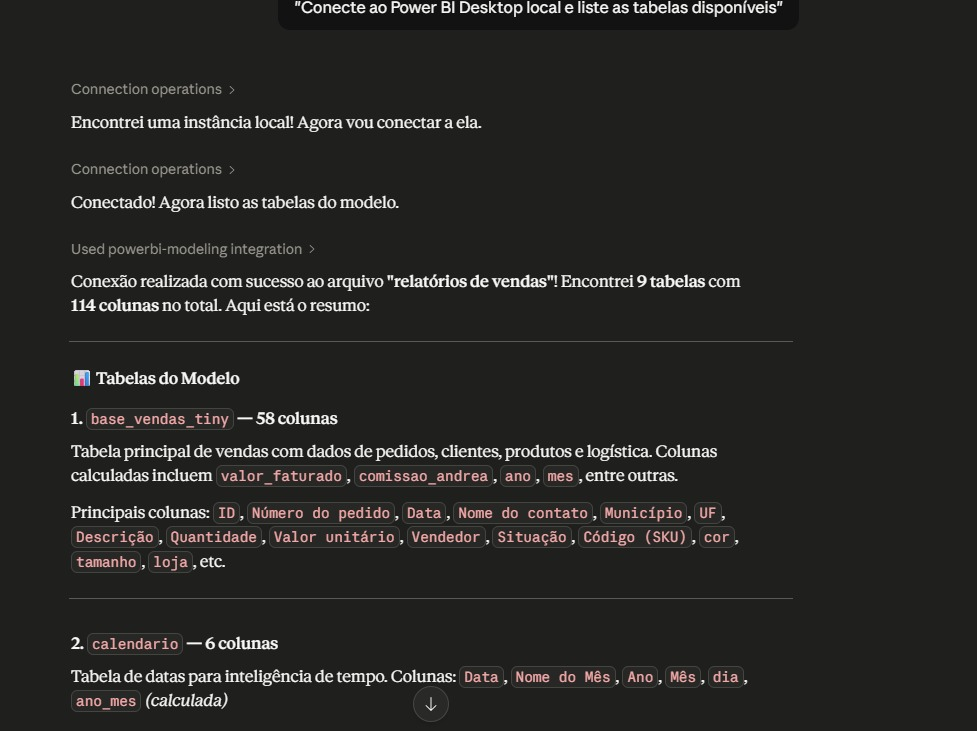
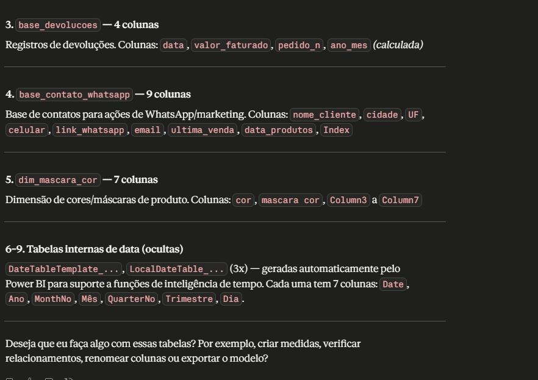

# Power BI + Claude AI via MCP — Integração Local

Conectando o Claude Desktop ao Power BI Desktop usando o Model Context Protocol (MCP) para análise de dados assistida por IA — de forma local, segura e sem custos de API.

---

## Sobre este projeto

Este repositório documenta o processo completo de integração entre o **Claude Desktop** (Anthropic) e o **Power BI Desktop** utilizando o **Power BI Modeling MCP Server** — uma extensão para VS Code que cria uma ponte entre os dois aplicativos via Model Context Protocol.

O objetivo é permitir que o Claude leia, interprete e interaja com modelos semânticos do Power BI diretamente, sem necessidade de exportar dados ou copiar estruturas manualmente.

---

## O que essa integração permite fazer

- Listar tabelas e colunas do modelo semântico automaticamente
- Criar e modificar medidas DAX via linguagem natural
- Analisar relacionamentos entre tabelas
- Gerar código HTML para dashboards customizados dentro do Power BI
- Tudo isso sem sair do Claude Desktop

---

## Pré-requisitos

| Ferramenta | Versão testada | Link |
|---|---|---|
| Windows | 10/11 | — |
| VS Code | Qualquer recente | [Download](https://code.visualstudio.com/) |
| Claude Desktop | Gratuito | [Download](https://claude.ai/download) |
| Power BI Desktop | Gratuito | [Download](https://powerbi.microsoft.com/) |
| Extensão Power BI Modeling MCP | 0.4.0 | VS Code Marketplace |

---

## Estrutura do repositório

```
powerbi-claude-mcp/
│
├── README.md
├── config/
│   └── claude_desktop_config_template.json
├── assets/
│   └── (imagens e prints)
└── docs/
    ├── 01_instalacao.md
    ├── 02_configuracao.md
    ├── 03_troubleshooting.md
    └── 04_primeiros_passos.md
```

---

## Instalação e Configuração

### 1. Instale a extensão no VS Code

No VS Code, abra a aba de extensões (`Ctrl + Shift + X`) e busque por:
```
Power BI Modeling MCP Server
```
Instale a extensão da **Analysis Services**.

---

### 2. Localize o executável

Após instalar, o executável estará dentro da pasta de extensões do VS Code:
```
C:\Users\SEU_USUARIO\.vscode\extensions\analysis-services.powerbi-modeling-mcp-X.X.X-win32-x64\server\powerbi-modeling-mcp.exe
```

Substitua `SEU_USUARIO` pelo seu usuário do Windows e `X.X.X` pela versão instalada.

---

### 3. Localize a pasta de configuração do Claude Desktop

> **Atenção:** O caminho da pasta de configuração varia conforme o método de instalação do Claude Desktop. Não tente adivinhar o caminho — use o método abaixo para encontrá-lo com precisão.

Abra o Claude Desktop e acesse **Settings → Developer → Edit Config**.

Isso abrirá automaticamente a pasta correta no Explorador de Arquivos, independente de onde o app foi instalado.

Dentro dessa pasta, edite o arquivo `claude_desktop_config.json` com o seguinte conteúdo:

```json
{
  "mcpServers": {
    "powerbi-modeling": {
      "command": "C:\\Users\\SEU_USUARIO\\.vscode\\extensions\\analysis-services.powerbi-modeling-mcp-X.X.X-win32-x64\\server\\powerbi-modeling-mcp.exe",
      "args": ["--start", "--skipconfirmation"]
    }
  }
}
```

> **Atenção:** No JSON, as barras do caminho devem ser duplas (`\\`).

> **Ponto crítico:** Se na pasta existirem dois arquivos — `claude_desktop_config` (sem extensão) e `claude_desktop_config.json` — edite **apenas o arquivo com extensão `.json`**. O outro é ignorado pelo Claude Desktop.

---

### 4. Ative os recursos no Power BI Desktop

No Power BI Desktop: **Arquivo → Opções e configurações → Opções → Recursos de visualização**

Ative os seguintes itens:
- Armazenar modelo semântico usando o formato TMDL
- Armazene relatórios usando formato de metadados aprimorado (PBIR)
- Armazenar relatórios PBIX usando o formato de metadados aprimorado (PBIR)
- Preparar dados para IA

Reinicie o Power BI Desktop após ativar e salve seu arquivo `.pbix`.

---

### 5. Reinicie o Claude Desktop e verifique

Encerre o Claude Desktop completamente. Você pode forçar o encerramento pelo PowerShell:
```powershell
Stop-Process -Name "claude" -Force
```

Reabra o Claude Desktop e vá em **Settings → Developer**. O servidor `powerbi-modeling` deve aparecer como **running**.

---

## Testando a conexão

Com o arquivo `.pbix` aberto no Power BI Desktop, abra uma nova conversa no Claude Desktop e digite:

```
Conecte ao Power BI Desktop local e liste as tabelas disponíveis
```

Se tudo estiver correto, o Claude irá encontrar a instância local do Power BI, conectar automaticamente e listar todas as tabelas e colunas do modelo.




---

## Troubleshooting

**"No servers added" após reiniciar o Claude Desktop**

Verifique se está editando o arquivo correto. Na pasta de configuração podem existir dois arquivos com nomes parecidos — `claude_desktop_config` e `claude_desktop_config.json`. O Claude Desktop lê apenas o arquivo com a extensão `.json`.

---

**O Power BI não está sendo detectado**

Certifique-se de que o arquivo `.pbix` foi salvo após ativar os recursos TMDL/PBIR. O Power BI precisa ser salvo no novo formato para expor a conexão local ao MCP.

---

**Variáveis de ambiente não funcionam no terminal**

No PowerShell, use a sintaxe correta:
```powershell
# Correto no PowerShell
dir $env:APPDATA
dir $env:LOCALAPPDATA

# Incorreto no PowerShell (funciona apenas no CMD)
dir %APPDATA%
```

---

## Considerações sobre LGPD

Esta integração roda **localmente** — o MCP conecta o Claude ao Power BI via porta local, sem transmitir dados para servidores externos.

O ponto de atenção é que o conteúdo das **conversas** com o Claude Desktop é processado nos servidores da Anthropic. Por isso, recomenda-se:

- Trabalhar com dados agregados e anonimizados sempre que possível
- Evitar expor registros individuais com dados pessoais (nomes, CPFs, telefones)
- Usar o Claude principalmente para criar estruturas DAX, não para navegar em dados brutos

---

## Referências

- [Como conectar o Power BI ao Claude — TheBILab](https://www.thebilab.com.br/post/como-conectar-o-power-bi-ao-claude-dashboards)
- [Model Context Protocol — Anthropic](https://docs.anthropic.com/mcp)
- [Power BI Modeling MCP Server — VS Code Marketplace](https://marketplace.visualstudio.com/)

---

## Autor

**Marcos Ferrel Fonseca**  
Analista de BI & Inteligência Artificial Aplicada

---

> Se este repositório foi útil para você, considere deixar uma estrela.
